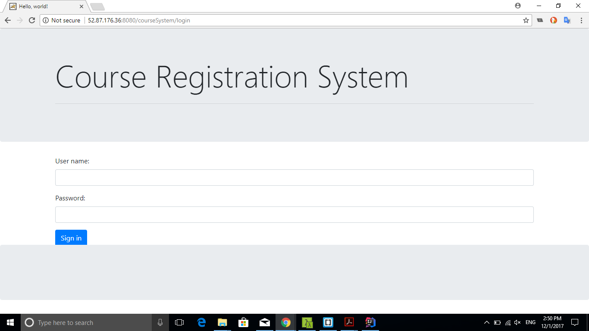
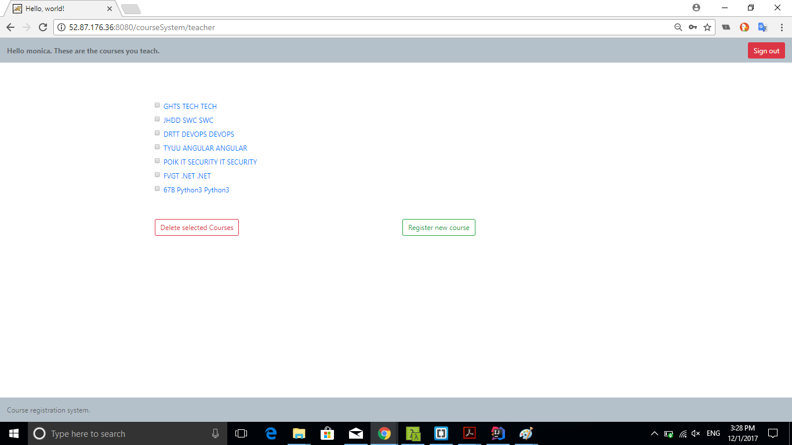
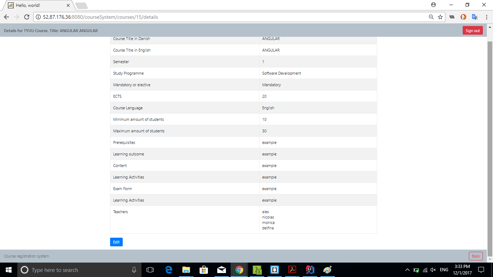
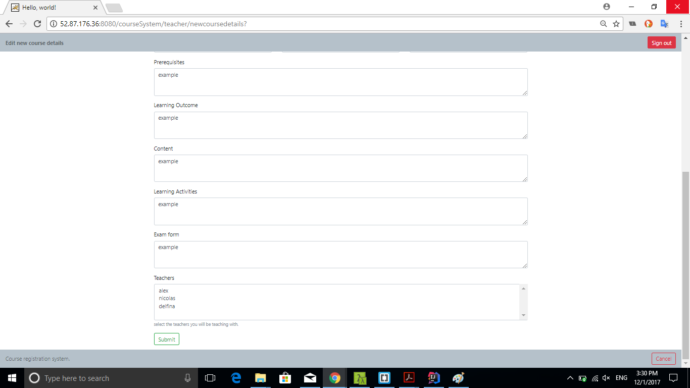
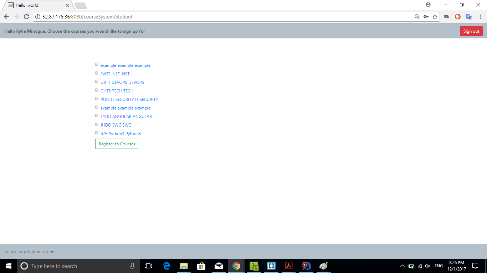
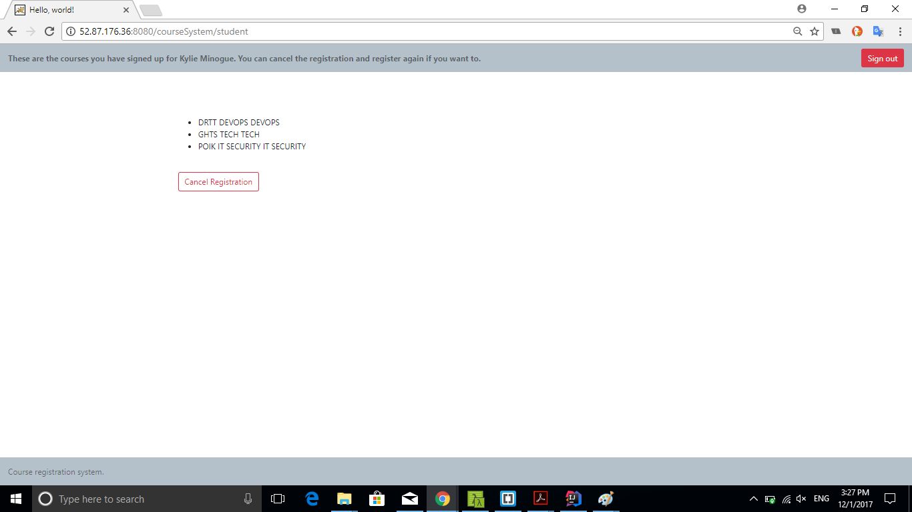

# courseregistrationsystem
Project for SWC3 &amp; TECH2 at KEA.

## Screenshots User Guide
Our system supports two diferrent kind of roles, teachers and students.
You can login using any of the following credentials:
- Students: kylie 1234, nickcave 1234
- Teachers: alex 1234, monica 1234, nicolas 1234, delfina 1234

Main teachers page, with options for deleting and creating courses.

By clicking on the course link on the previous page you get to see the course details and the edit option.

Course details are shown in a form for editing.

Main page for student, list of all available courses.

Page displaying the selected courses.

## Deployment

- We used the infrastructure provided by AWS to set up the production environment for the system.
- We have a VPC and two subnets in two different availablility zones.
- An internet gateway attached to the VPC.
- An RDS instance on the subnet group with a security group that permits traffic only from within the VPC.
- Two subnets in two different availability zones, for two ec2 instances.
- Each instance has a tomcat8 java servlet container installed and running.
- One of the ec2 instances has Jenkins automation server installed, as a deployment tool, for building, testing and deploying the system
on both ec2 instances.
- We also attached an ELB for distributing traffic across our ec2 instances, but removed it for economic reasons. 

One can have read only access to our setup, by logging in [here](https://954604134118.signin.aws.amazon.com/console) and using the following credentials:

- username: teacher
- password: keateacher
